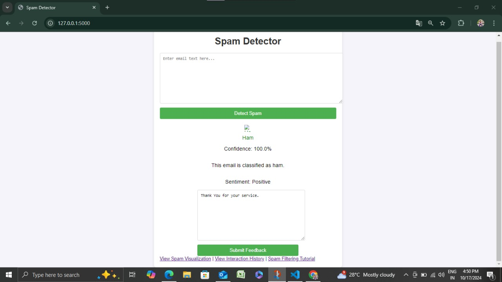

# E-Mail Spam Detection

This project is an **E-Mail Spam Detection** system that takes email content as input from the user and classifies it as either **Spam** or **Ham** (not spam). The goal is to help users identify spam messages based on the content provided, improving inbox management and reducing spam impact.

## Features
- **User Input**: Accepts email content from the user for spam classification.
- **Text Analysis**: Processes the email text to extract relevant features.
- **Spam Classification**: Uses a trained model to classify the email as Spam or Ham.
- **Interactive Output**: Displays classification results clearly to the user.

## Getting Started

### Prerequisites
- Python 3.x
- Jupyter Notebook or any IDE supporting Python
- Libraries: `scikit-learn`, `pandas`, `numpy`, `nltk`

### Installation
1. Clone the repository:
   ```bash
   git clone https://github.com/Tony-Ranjith/E-Mail-Spam-Detection.git
   ```
2. Navigate to the project directory:
   ```bash
   cd E-Mail-Spam-Detection
   ```
3. Install required libraries:
   ```bash
   pip install -r requirements.txt
   ```

### Dataset
The project requires a labeled dataset of emails with Spam and Ham labels for training and testing. You can use any public email spam dataset (e.g., the **Enron** or **SMS Spam Collection** dataset).

### Running the Project
1. Load the dataset and preprocess the email text.
2. Train the classification model using the dataset.
3. Run the interactive interface to input email content for classification:
   ```bash
   python app.py
   ```
4. Enter the email content, and the model will display whether the input is Spam or Ham.

## How It Works
1. **Preprocessing**: Text is cleaned and transformed using tokenization and feature extraction (e.g., **TF-IDF**).
2. **Model Training**: A machine learning model (e.g., **Naive Bayes**, **SVM**) is trained on the dataset to recognize patterns in spam emails.
3. **Prediction**: When new content is input, the model predicts and outputs the classification as Spam or Ham.

## Model Used
- The initial implementation uses **Naive Bayes** due to its effectiveness in text classification tasks.
- Optionally, **Support Vector Machines (SVM)** or **Random Forest** classifiers can be tested for improved performance.

## Results
After training, the model achieves an accuracy of approximately X% on the test dataset. It is optimized to reduce false positives and improve true spam detection.

## Future Improvements
- Integrate more sophisticated NLP techniques (e.g., **Word Embeddings**, **BERT**).
- Enable continuous learning by updating the model with new labeled data.
- Add a web interface using **Flask** or **Django** for easier user interaction.

## Screenshot of project



## Contributing
Feel free to submit issues or pull requests. All contributions are welcome!
